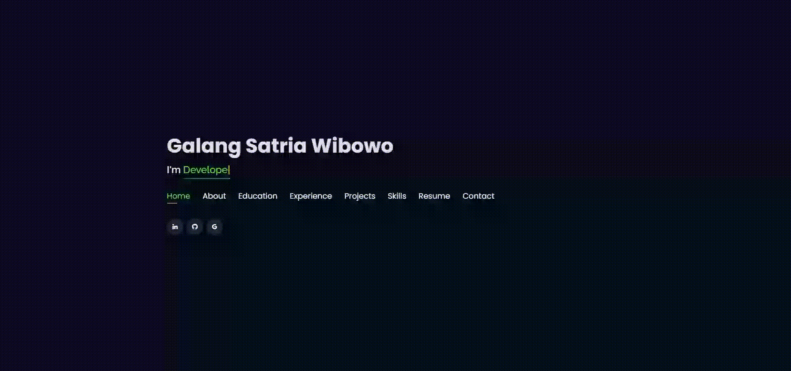
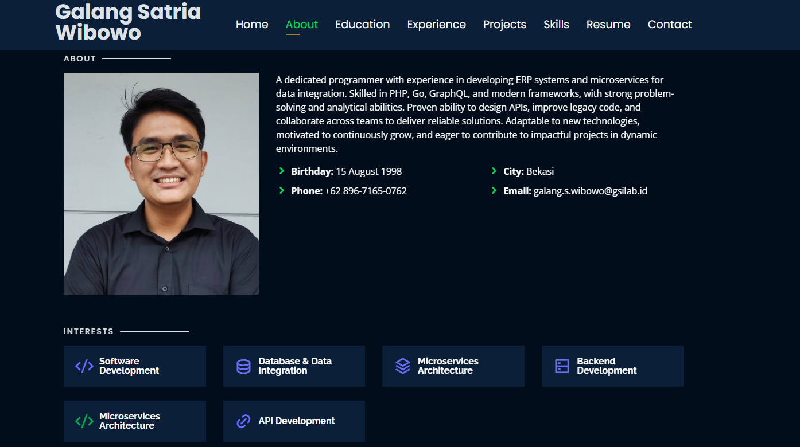
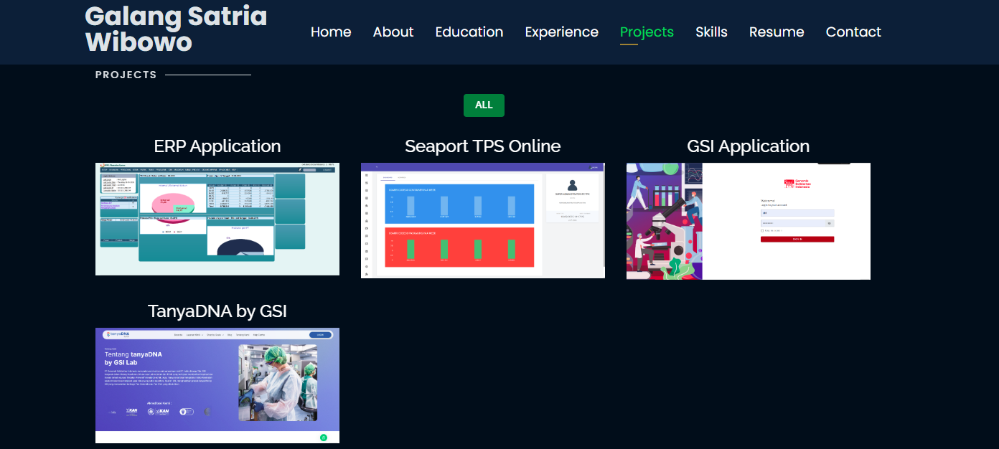

# 🚀 Personal Portfolio Website

Halo! 👋  
Ini adalah repository untuk **website portfolio saya**, yang bisa diakses di sini:  
👉 **[brogalang.github.io](https://brogalang.github.io/)**

Website ini saya buat untuk menampilkan pengalaman, proyek, dan skill saya sebagai software engineer.  
Dibangun dengan **HTML, CSS, dan JavaScript**, serta di-host di **GitHub Pages**.

---

## 🌐 Preview Website
### 🏠 Home Page

### 🙋 About Page

### 📂 Projects Page

---

## ✨ Fitur Utama
- ⚡️ Fully Responsive (mobile friendly)
- ⚡️ Animasi mengetik menggunakan `Typed.js`
- ⚡️ Valid HTML5 & CSS3
- ⚡️ Mudah dimodifikasi

---

## 📑 Bagian Website
- ✅ About  
- ✅ Interests  
- ✅ Education  
- ✅ Experience  
- ✅ Projects  
- ✅ Skills  
- ✅ Resume  
- ✅ Contact Info  

---

## 🛠️ Tools yang Digunakan
- **GitHub Pages** → untuk hosting website statis  
- **HTML, CSS, JS** → core development  
- **Typed.js** → animasi teks  

---

⭐ Jangan lupa kasih **star** repo ini di GitHub kalau menurutmu keren! ⭐